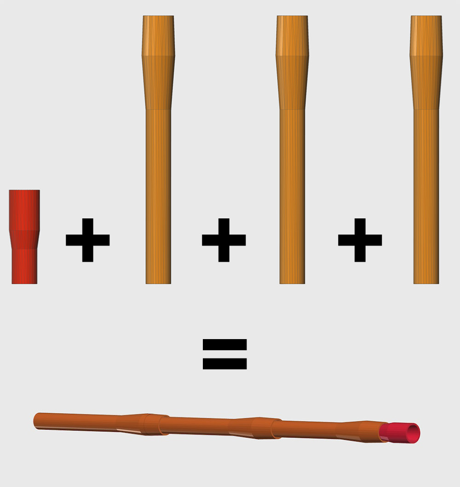
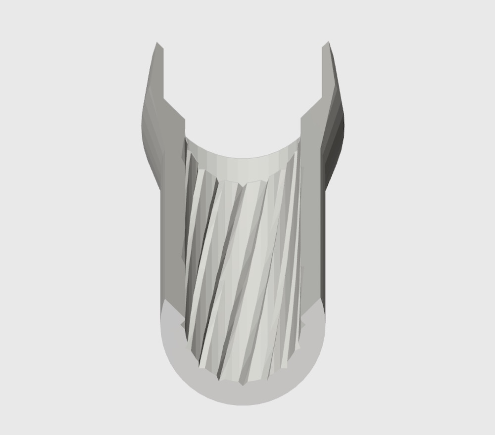
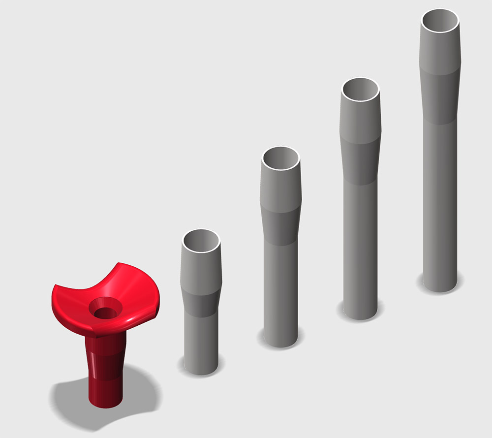

```
	-------------------------------------------------------------------------------
	 _   _  _________________ 	 ______ _     _____  _    _______ ___________ _____  
	| \ | ||  ___| ___ \  ___|	 | ___ \ |   |  _  || |  | | ___ \_   _| ___ \  ___| 
	|  \| || |__ | |_/ / |_   	 | |_/ / |   | | | || |  | | |_/ / | | | |_/ / |__   
	| . ` ||  __||    /|  _|  	 | ___ \ |   | | | || |/\| |  __/  | | |  __/|  __|  
	| |\  || |___| |\ \| |    	 | |_/ / |___\ \_/ /\  /\  / |    _| |_| |   | |___  
	\_| \_/\____/\_| \_\_|    	 \____/\_____/\___/  \/  \/\_|    \___/\_|   \____/  
	
	--------------------------------------------------------------------------------
                                                                                                                                                                                           

```
> Nerf darts Parametric BlowPipe Inspire by [Franck Youdine](https://twitter.com/fyoudine) Nerf darts paper blowpipe 



## DISCLAIMER

You are using this at your own risks, nerf darts are relatively safe but can still hurts eyes. I can not been made responsible of any stupid things you will do with this. 

## ABOUT

Nerf darts are fun, specially in office opens pace, but Nerf gun are not very powerful and not accurate at all.
We have used them a lot in the office and then Franck Youdine made a paper blowpipe to send darts. It was so accurate and so powerful that I decided to build one using my 3D printer.

The longer the pipe the more it will be accurate, it was a bit challenging to print a long pipe has pipe need to be printed vertically. That were I came with the idea of module that could be connected and printed separately.


Depending of you printer maximum print height use the script to generate module of the perfect height. The blow module make the pipe confortable and efficient.

To stabilise the darts during the flight I get this idea of [Rifling](https://en.wikipedia.org/wiki/Rifling) so you have an option to add some groove inside the pipe. Still not sure of the efficiency, I need to get a high frame rate camera to check if the darts rotate during the flight.




## REQUIREMENTS

You will need [OpenScad](http://www.openscad.org/) free software to generate the blowpipes.

## How to

After installing [OpenScad](http://www.openscad.org/) just use it to open the ```demo.scad``` file.
The screen should preview the pipe below. 




Then use the code below or uncomment different part of the demo file to generate your pipes.


> First you need to include the lib

```
include <blowpipe.scad>;
```

> see the demo


```
/**
 * @param {boolean} HasGroove
 */
demo(true); 
```

> Generate the blow module

```
/**
 * @param {number} PipeLength
 * @param {boolean} HasGroove
 */
blowModule(length,groove); 
```

> Generate pipes

```
/**
 * @param {number} PipeLength
 * @param {boolean} HasGroove
 */
blowPipe(length);
```

## ADVANCED PARAMETERS

```

$fn                 =   50;          // Mesh quality (number of fragments )
fix_length          =   30;          // Length of th connectors
fix_ease            =   .2;          // ease between pipe to connect them

/** PIPE **/
internal_radius     =   6.7;        // do not change fine for standarts Nerf arrow // .5 inch ?
external_radius     =   9.5;        // radius of the pipe 

/** ENTRANCE  **/
entrance_radius     =   6.5;        // Manage the pressure on the arrow in the entrance, more pressure = more speed = harder to blow.
entrance_length     =   20;         // entrance length sould also have an impact on speed.

// GROOVE
groove_twist        =   45;         // number of rotation per module default:90;
groove_size         =   1;          // Size of the groove (must not be bigger than External radius - Internal radius default:2
groove_number       =   16;         // Number of groove default:4;


```


## 3D PRINTING

Those part should be printed as they came out of the script without any support.

```
infill				: 15% 
layer heigth		: 0.3mm
Top solid layer 	: 3
Bottom solid layer 	: 3
Outline perimeter 	: 2
```

