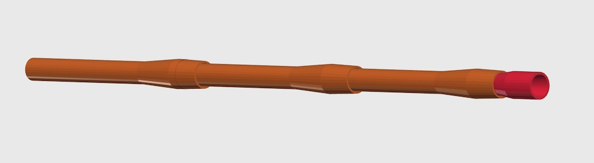

# A Parametric BlowPipe 
> That works fine with Nerf dart




## REQUIREMENTS

You will need [OpenScad](http://www.openscad.org/) free software to generate the blowpipes

## USAGE

- BlowPipe should be 1 meter long idealy, for the ease of printing the pipe is splitted in part.
- Part should be printed vertically and each part should be as long as possible (depending of your printer)


## OpenScad API

> Include the lib

```
include <blowpipe.scad>;
```

> see the demo


```
demo(length); 
```

> Generate the blow module

```
blowModule(length); 
```

> Generate pipes

```
blowPipe(length);
```

## LENGTH

The length of the pipe, the maximum value depend of the capacity of your printer. The minimum is 50;

## PRINTING
Those part should be printed as they came out of the script without any support and a small infill around 10% is ok.
