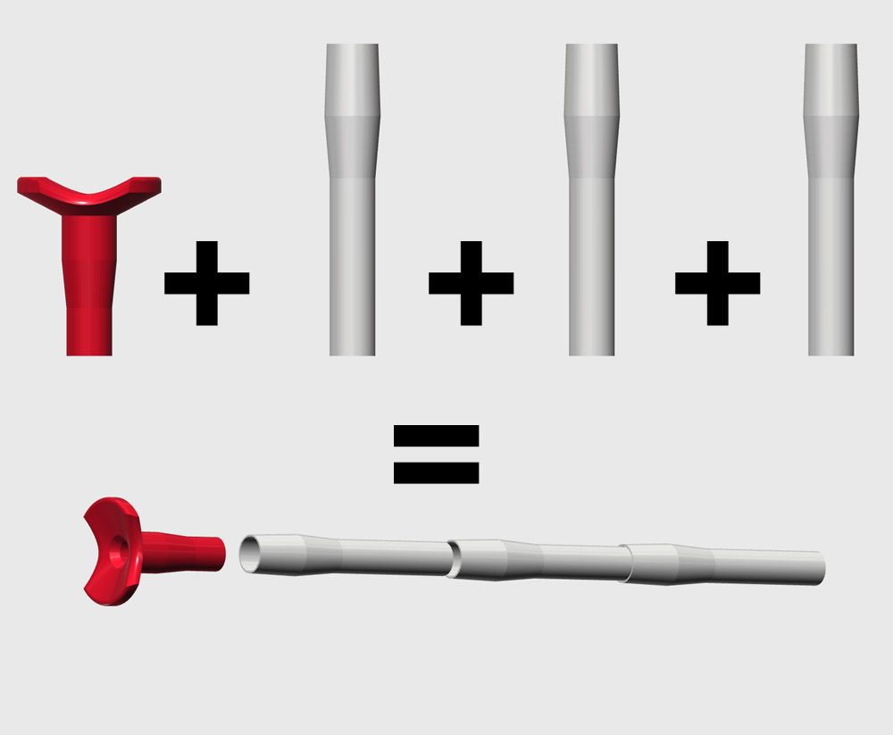

# Nerf Dart Parametric BlowPipe 
> Inspire by [Franck Youdine](https://twitter.com/fyoudine) Nerf dart Paper blowpipe 




## REQUIREMENTS

You will need [OpenScad](http://www.openscad.org/) free software to generate the blowpipes

## USAGE

- BlowPipe should be 1 meter long idealy, for the ease of printing the pipe is splitted in part.
- Part should be printed vertically and each part should be as long as possible (depending of your printer)


## OpenScad API

> First you need to include the lib

```
include <blowpipe.scad>;
```

> see the demo


```
/**
 * @param {boolean} HasGroove
 */
demo(true); 
```

> Generate the blow module

```
/**
 * @param {number} PipeLength
 * @param {boolean} HasGroove
 */
blowModule(length,groove); 
```

> Generate pipes

```
/**
 * @param {number} PipeLength
 * @param {boolean} HasGroove
 */
blowPipe(length);
```

## ADVANCED PARAMETERS

```
// SETTINGS
$fn                 =   50;          // Mesh quality (number of fragments )    
fix_length          =   30;          // Length of th connectors
fix_length_blow     =   5;      
fix_ease            =   .2;          // ease between pipe to connect them

// CONNECTOR LENGTH
fix_connector_length=   .5;         // Length ratio // deprecated
fix_connector_length_ratio = .2;    // Regarding the pipe length

// PIPE
internal_radius     =   6.7;        // do not change fine for standart Nerf arrow // .5 inch ?
external_radius     =   9.5;        // radius of the pipe 

// ENTRANCE 
/**
Used to compress the dart inside the pipe to maximyse the pressure
**/
entrance_radius     =   6.5;        // entrance used to manage the pressure on the arrow in the entrance
entrance_length     =   20;         // entrance length

// GROOVE
groove_twist        =   45;         // number of rotation per module default:90;
groove_size         =   1;          // Size of the groove (must not be bigger than External radius - Internal radius default:2
groove_number       =   8;          // Number of groove default:4;
```


## LENGTH

The length of the pipe, the maximum value depend of the capacity of your printer. The minimum is 50;


## PRINTING

Those part should be printed as they came out of the script without any support and a small infill around 10% is ok.

